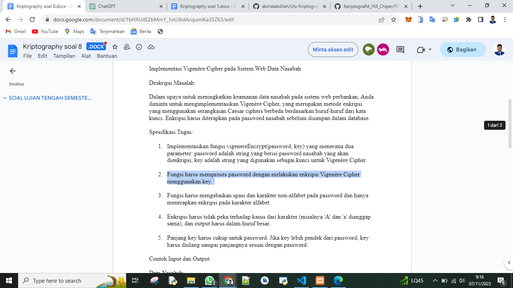
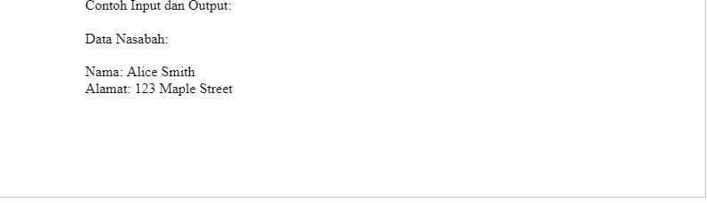
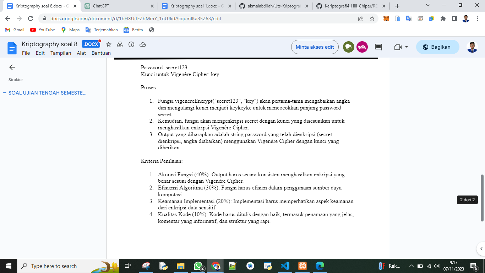
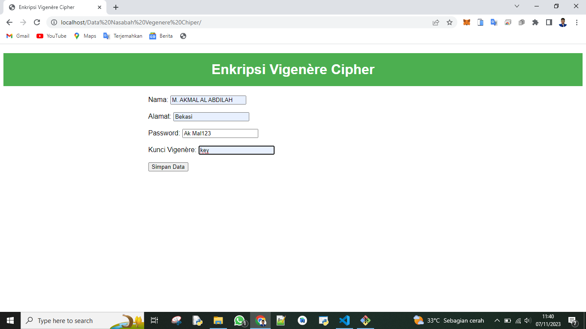
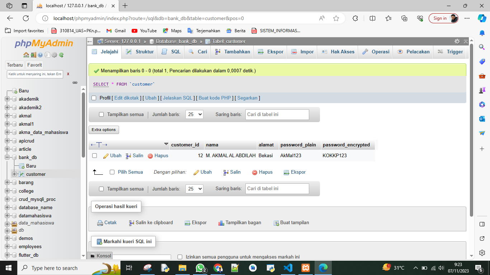

# Uts-Kriptografi

# Kriptografi Pertemuan 8

## Profil
| #               | Biodata                      |
| --------------- | ---------------------------- |
| **Nama**        | M. AKMAL AL ABDILAH          |
| **NIM**         | 312110034                    |
| **Kelas**       | TI.21.A.1                    |
| **Mata Kuliah** | Kriptografi                  |

 

## Tugas Uts

1. Implementasikan fungsi vigenereEncrypt(password, key) yang menerima dua parameter: password adalah string yang berisi password nasabah yang akan dienkripsi; key adalah string yang digunakan sebagai kunci untuk Vigenère Cipher.

2. Fungsi harus memproses password dengan melakukan enkripsi Vigenère Cipher menggunakan key.

3. Fungsi harus mengabaikan spasi dan karakter non-alfabet pada password dan hanya menerapkan enkripsi pada karakter alfabet.

4. Enkripsi harus tidak peka terhadap kasus dari karakter (misalnya 'A' dan 'a' dianggap sama), dan output harus dalam huruf besar.

5. Panjang key harus cukup untuk password. Jika key lebih pendek dari password, key harus diulang sampai panjangnya sesuai dengan password.

Jawaban Kode dan Database

Oke sekian penjelasan singkat saya mengenai tugas kriptografi kali ini jika kalian masih penasara kalian bisa mencoba file lengkap code yang ada di atas kurang lebih saya mohon maaf.

 sekian and selesai.

<h2 align="center">Thanks For Reading!!!</h2>

